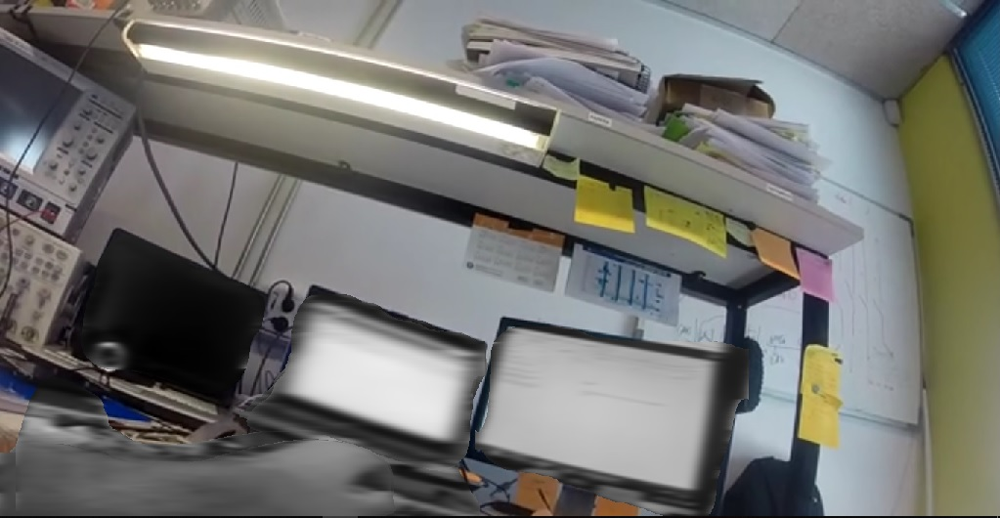

# Privacy_Protection_based_on_MaskRCNN_InceptionV2 

Mask-RCNN was initially introduced in Nov 2017 by Facebook’s AI Research team using Python and Caffe2.This is an implementation of [Mask R-CNN](https://arxiv.org/abs/1703.06870) on Python 3.Privacy is protected by detecting sensitive objects and segmenting those from video.The model can generate bounding boxes and segmentation masks of each instance in the image.It's based on InceptionV2 backbon.The Mask-RCNN algorithm produces the predicted detection outputs as the bounding boxes. Each bounding box is associated with a confidence score. All the boxes below the confidence threshold parameter are ignored for further processing.The object mask output from the network is a greyscale image. One could use it directly for alpha blending purposes, if needed.we use the maskThreshold parameter to threshold the grey mask image.We can reduce its value would result in a larger mask. Sometimes this helps include the parts missed near the boundaries, but at the same time, it might also include the background pixels at the more pointy boundary regions and more noises.One thing to remember,lowering the threshold value you may also can gain mask of object at a distance which is hardly noticed by people too.
Demo of this work:

# The repository includes:
* Source code of Mask R-CNN built InceptionV2.
* Source code for Privacy protection for single image
* Source code for Privacy protection in a video
* Pretrained model config file(Text graph file)
(You should download pretrained model weight file.I can't include it because of file size restriction)

# Installation
1. Clone this repository

2. Install dependencies
(OpenCV 3.4.3. or above,numpy and other basic dependencies which is usually used)
If you need help you can check (https://jeanvitor.com/cpp-opencv-windonws10-installing/)

3. Download pre-trained COCO weights (frozen_inference_graph.pb) from the [model zoo](https://github.com/tensorflow/models/blob/master/research/object_detection/g3doc/detection_model_zoo.md). Download it from mask_rcnn_inception_v2_coco and you need to put frozen_inference_graph.pb file in mask-rcnn-coco after extraction.

# Getting Started
* [mask_rcnn.py](mask_rcnn.py) You can run this pretrained model on this code.Here you will get the visualization how this detection model generate bounding box and mask.But it works only on image.(Before running it don't forget to change your code directory to this main folder)
* [Privacy_Protected_Video.py](Privacy_Protected_Video.py) This is the main code to run for this project.It runs on a video or on an image(You can find both in this code,one may be commented out).We ran this code for our vip cup dataset and saved it into Mp4 format.
It takes videos from a folder named 'nextbatchRun'(You should create one and put any video in it which you want as input) and put the output actually protected video to 'output' folder(You should create this also).

##Demo video of MaskRCNN Inception V2

 *https://www.youtube.com/watch?v=Yqj7h7qw1Mw
 *https://www.youtube.com/watch?v=Mbv6g676cNE

##To know more about it

*[Paper on MaskRCNN](https://arxiv.org/abs/1703.06870)

*[Paper on MaskRCNN](https://www.freecodecamp.org/news/mask-r-cnn-explained-7f82bec890e3/)

## Acknowledgement 
Tons of code was downloaded from theirs repo and website

*https://www.learnopencv.com/deep-learning-based-object-detection-and-instance-segmentation-using-mask-r-cnn-in-opencv-python-c/

*https://github.com/tensorflow/models/blob/master/research/object_detection/g3doc/detection_model_zoo.md

